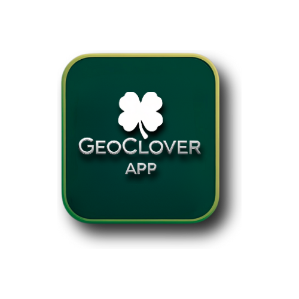

<p align="center">
  <a href="https://geoclover-app.netlify.app" target="_blank">
    
  </a>
</p>

# GeoClover-v2 Frontend

> A React + Vite app for GeoClover-v2: explore and document four-leaf clover sightings on an interactive map.

🌱 **Live App:** https://geoclover-app.netlify.app
---

## 👩‍💻 About Me

👋 Hi, I’m **Cristy Parsons** ([@Cparsons0085](https://github.com/Cparsons0085))  
🎓 Geospatial Technologies + DevOps / Full-Stack  
🔭 Building GeoClover-v2: a fun, GIS-powered pin-drop experience  
📫 Reach me via GitHub Issues or email at `cristylynn0920@gmail.com`

---

## 🌟 Key Features

- **Username/Password Login** (custom auth - no ArcGIS OAuth)  
- **Real-time Map Pins** via Socket.IO & ArcGIS JS API (connected to ArcGIS hosted feature layers)  
- **Photo Capture**: with GPS + Timestamp (snap a picture of your clover on click)  
- **GeoClover Doodles**: mini coding-themed sketch games  
- **Clover Mascot**: playful guide for hints and interactions  
- **Persistent Settings** with `localStorage`

---
> **Roadmap (coming soon):**
> - **GeoClover Doodles** mini-games
> - **Clover Mascot** helper (tips, trivia, guidance)
---

## 🛠️ Tech Stack

- **Frontend**: React + Vite
- **Backend**: Node.js + Express (Render)  
- **Mapping**: ArcGIS JS API + Hosted Feature Layer 
- **Realtime**: Socket.IO (client)  
- **HTTP**: Axios  
- **Styling**: Tailwind CSS  
- **Persistence**: `localStorage`  

---

## ⚙️ Environment Variables

The project uses Vite environment variables to connect the frontend to the backend API and ArcGIS Online web mapping services.

Create the following environment variable files in the project root (already listed in `.gitignore`):

### `.env.development` (for local development)
```env
VITE_BACKEND_URL=http://localhost:3000
VITE_ARCGIS_VIEW_URL=https://services1.arcgis.com/.../GeoCloverPins_4view/FeatureServer/0

.env.production (for Netlify deployment)
VITE_BACKEND_URL=https://your-backend-url.onrender.com
VITE_ARCGIS_VIEW_URL=https://services1.arcgis.com/.../GeoCloverPins_4view/FeatureServer/0
```
---
## 🔮 Roadmap

Landing page with slogan: “Don’t Pluck Your Luck”

User gallery with filters by username/date

Expanded mascot with tips, trivia, and guidance

Integration into CloverHub, a central hub for clover-themed apps
---
## 📌 Related

Backend (deploy): https://geoclover-v2-backend.onrender.com

Frontend (deploy): https://geoclover-app.netlify.app
